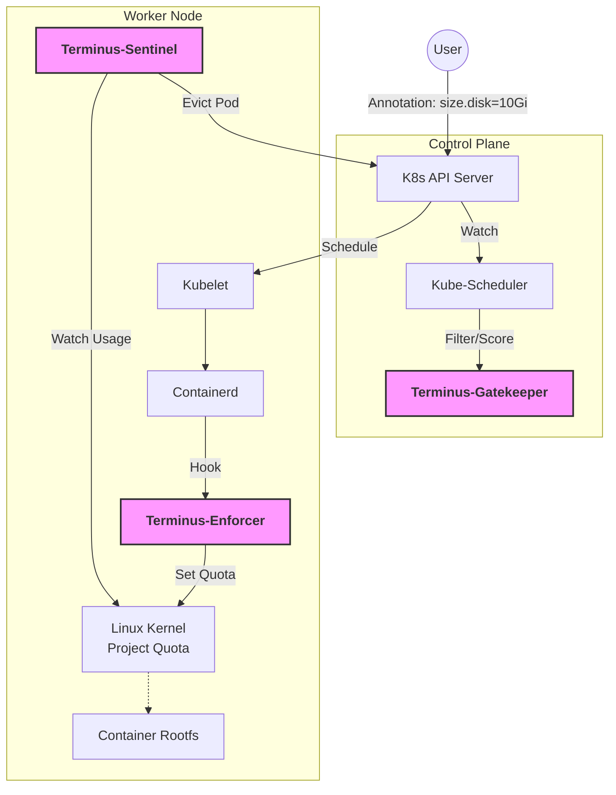

# 🏛️ Terminus


<p align="center">
  <b>The Boundary God for Kubernetes Ephemeral Storage.</b>
</p>

<p align="center">
  <a href="https://kubernetes.io"></a>
  <a href="https://github.com/containerd/nri"></a>
  <a href="LICENSE"></a>
  <a href="#"></a>
  <a href="https://golang.org"></a>
</p>

---

## 📖 Introduction

**Terminus** is a cloud-native storage governance system designed to secure Kubernetes nodes from **Rootfs/Overlayfs exhaustion**.

In standard Kubernetes, ephemeral storage limits (`requests.ephemeral-storage`) are soft limits enforced by periodic Kubelet scanning (`du`). This mechanism is IO-intensive, slow to react, and ineffective against rapid disk consumption, often leading to node instability ("Noisy Neighbor" problems).

**Terminus** solves this by enforcing **Hard Limits** at the Linux kernel level using **Project Quota**. It also introduces a **Disk-Aware Scheduler** to balance I/O pressure based on real disk usage, ensuring node stability under high load.

> *"Terminus, the Roman god of boundaries, yields to no one."*

## 🚀 Key Features

* **🛡️ Kernel-Level Isolation (Terminus-Enforcer)**
  Enforce strict disk usage limits on container Rootfs using XFS/Ext4 Project Quota via **NRI (Node Resource Interface)**. Zero overhead, immediate enforcement.

* **🧠 Disk-Aware Scheduling (Terminus-Gatekeeper)**
  A scheduler plugin that filters and scores nodes based on **Real Physical Usage** and configurable **Over-provisioning Rates**. It prevents scheduling pods to nodes that are physically dangerously full, regardless of their allocation status.

* **⚡ Active Protection (Terminus-Sentinel)**
  An efficient node agent that monitors Project ID usage and triggers graceful **Eviction** when the physical disk is critically full (e.g., >90%), preventing node lock-up.

## 🏗️ Architecture

Terminus consists of three micro-components working in harmony:



## 🛠️ Prerequisites

Before installing Terminus, ensure your environment meets the following requirements:

* **Kubernetes**: v1.24+ (Requires Containerd with NRI support enabled).
* **Container Runtime**: Containerd v1.7+.
* **Filesystem**: The backend filesystem for `/var/lib/containerd` must be **XFS** or **Ext4** with Project Quota enabled (`prjquota` mount option).

## 📦 Installation

### 1. Enable NRI in Containerd

Edit your `/etc/containerd/config.toml` to enable the NRI plugin:

```toml
[plugins."io.containerd.nri.v1.nri"]
  disable = false
  disable_connections = false
  plugin_config_path = "/etc/nri/conf.d"
  plugin_path = "/opt/nri/plugins"
  socket_path = "/var/run/nri/nri.sock"

```

*Restart containerd after editing.*

### 2. Install Terminus via Helm

*(Coming soon)*

### 3. Manual Installation

```bash
# Apply CRDs (if any)
kubectl apply -f deploy/crds/

# Install the Node Agent (Enforcer & Sentinel)
kubectl apply -f deploy/manifests/agent-daemonset.yaml

# Install the Scheduler Plugin
kubectl apply -f deploy/manifests/scheduler-deployment.yaml

```

## 💻 Usage

### 1. Enforcing Limits via Annotation

Simply add the `storage.terminus.io/rootfs-limit` annotation to your Pod. Terminus will automatically inject the Project Quota limit.

```yaml
apiVersion: v1
kind: Pod
metadata:
  name: my-app
  annotations:
    # Limit the Rootfs (Overlayfs) to 10Gi (Hard Limit)
    storage.terminus.io/rootfs-limit: "10Gi"
spec:
  containers:
  - name: nginx
    image: nginx

```

### 2. Configuring Scheduling Policy

You can configure the `Terminus-Gatekeeper` via ConfigMap to set the over-provisioning strategy.

```yaml
apiVersion: v1
kind: ConfigMap
metadata:
  name: terminus-scheduler-config
  namespace: kube-system
data:
  config.yaml: |
    policy:
      # Reject scheduling if physical usage > 85%
      physicalThreshold: 85% 
      # Allow allocating up to 200% of physical capacity (Over-commitment)
      overProvisioningRate: 2.0

```

## 🗺️ Roadmap

* [ ] **v0.1 (MVP)**: NRI plugin implementation for XFS Project Quota.
* [ ] **v0.2**: Prometheus Exporter & Grafana Dashboard integration.
* [ ] **v0.3**: Scheduler Plugin with "Real Usage" awareness.
* [ ] **v1.0**: Full "Eviction Controller" and production readiness.

## 🤝 Contributing

We welcome contributions! Please see [CONTRIBUTING.md](https://www.google.com/search?q=CONTRIBUTING.md) for details on how to submit a PR.

1. Fork the repo.
2. Create your feature branch (`git checkout -b feature/amazing-feature`).
3. Commit your changes.
4. Push to the branch.
5. Open a Pull Request.

## 📄 License

Distributed under the Apache 2.0 License. See `LICENSE` for more information.
